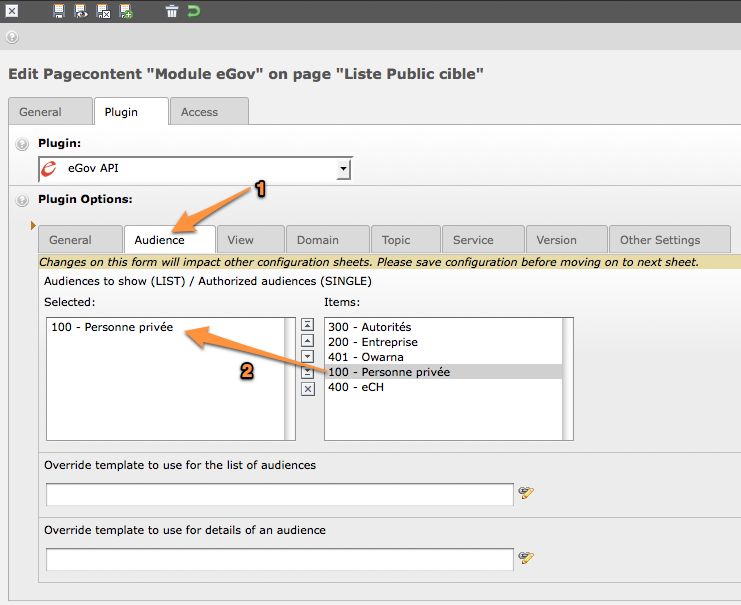
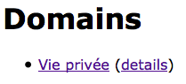

Use case
========

Description
-----------

You would like to show the list of service domains available for the audience “Personne privée”
(100) in some part of your website.

Step-by-step explanation
------------------------

1. Open Web > Page module and navigate within your website to the page where you would like to
   add the eGov API plugin.
2. Click on icon |new_ce| to add a content element to your page
3. Move to section “Plugins” and select the eGov API plugin:

.. |new_ce| image:: Images/UseCase/NewCE.png
.. image:: Images/UseCase/CEWizard.png
	:align: center

After having given a header to your content element as a best practice (possibly set its rendering
Type to hidden), you should configure the eGov API plugin:

.. image:: Images/UseCase/EditCE.png
	:align: center

1. Move to the “Plugin” tab to access plugin's configuration options
2. Select “General” option tab
3. Authorize level “Domain” to be shown. As this is the only selected level, it will be used as
   entry point for the plugin and will not allow navigation to other levels. If you need this, you
   may either add other authorized levels after the entry point level or configure redirect pages
   containing plugins for the other levels on “Other Settings” option tab.

Last step is to configure the plugin in order to only show the audience “Personne privée”:

1. Select “Audience” option tab
2. Select audience “Personne privée”.

That's it! If you show your page, you should have a list of domains related to the audience
“Personne privée”:

