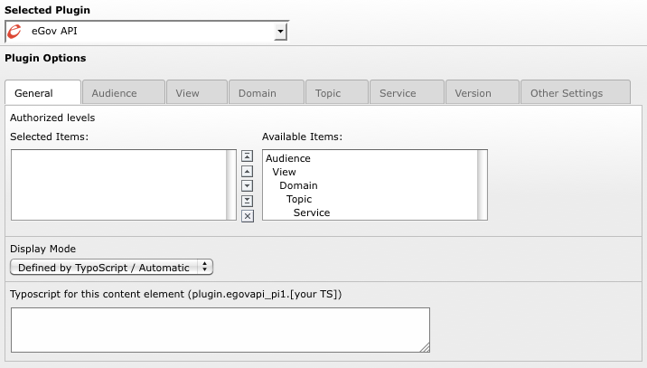
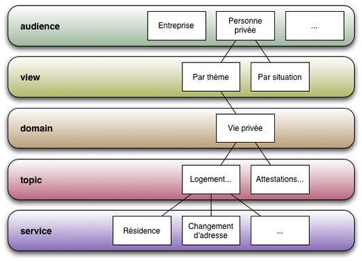
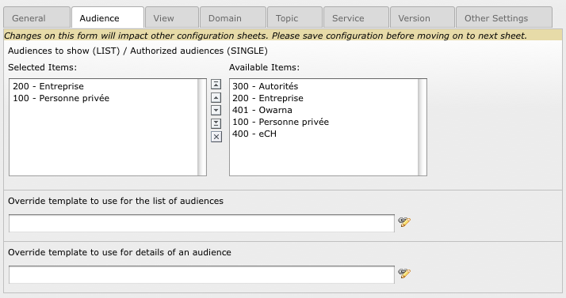
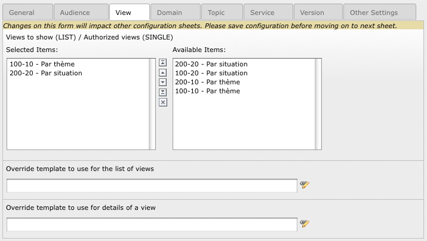
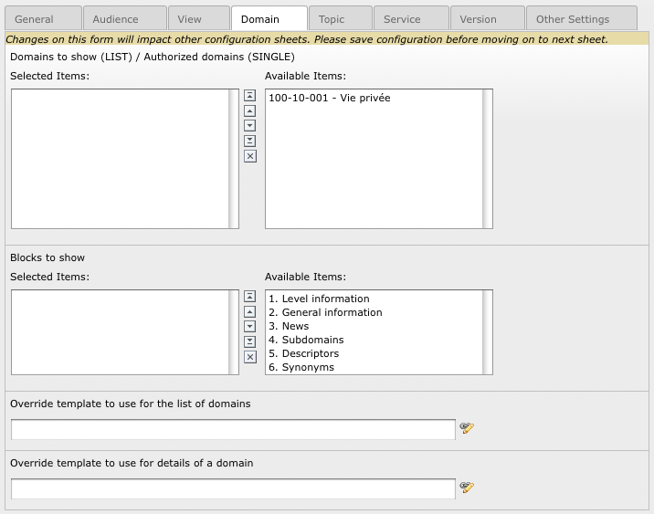
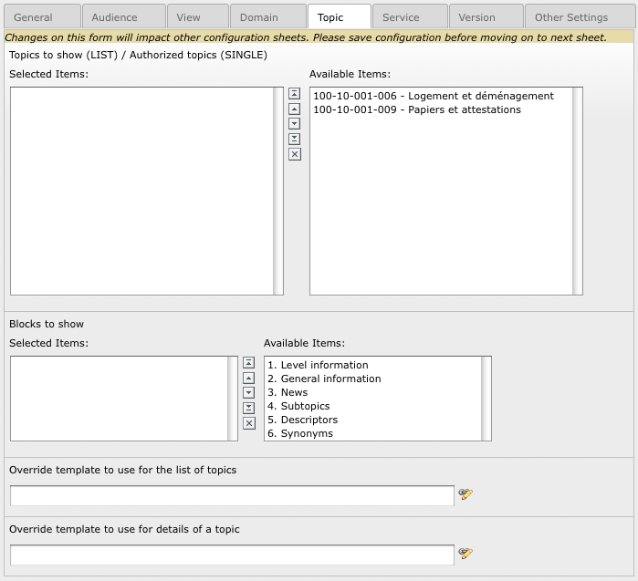
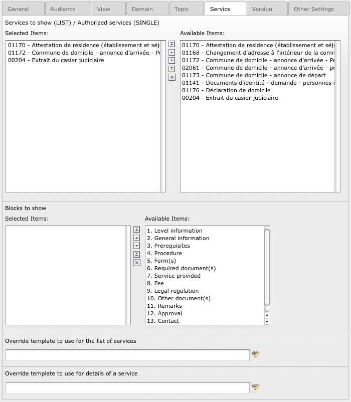
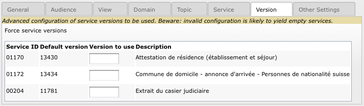

Plugin options
==============

The plugin is split among a general configuration tab and then a tab for each and every level of the
eGov API (Audience, View, Domain, Topic, Service). Finally a “Version” tab allows you to force a
given version of a service to be used instead of the default one. “Other Settings” provides a few
additional configuration options we will describe later on.

General
-------

The rules are as follows:

- If a field is left empty, the corresponding TypoScript property is taken into account.
- If the corresponding TypoScript property is empty, there is no restriction. In the screenshot
  above, leaving “Authorized levels” empty will let you freely navigate from Audience to Service
  back and forth.

**Backend administrators only:** Field myTS allows you to override the TypoScript configuration
after the merge of the FlexForm options. This is really the last chance to update the rendering
configuration. Any configuration option may be overridden except the web service related properties
(WSDL, cache lifetime, language, ...). A business processing makes use of it before the rendering
takes place. We assume it is more than unlikely to be needed anyway.

Level hierarchy
---------------

Before actually describing the options of the level configuration tabs, it may help giving us an
overview of the level hierarchy within the eGov web service:

Audience
--------

By selecting items, you trim down the list of items being shown by the plugin and this additionally
lets you manually order them.

Whenever you change the list of selected items in any of the Audience, View, Domain or Topic tab, you
should save your plugin configuration as the sublevel list of items in the next tab will be filtered
accordingly. E.g., in the screenshot above we selected “Entreprise” and “Personne privée” as
audiences to be shown and we ordered them to show “Entreprise” and then “Personne privée”. We should
now save the plugin configuration before moving on to tab “View” where we only will get views related
either to “Entreprise” or to “Personne privée” in the available items.

View
----

Domain
------

**Blocks to show:** This section is used when showing the details of a single domain. It allows us
to trim down the amount of information or to split them among multiple copies of the plugin on a
detail page.

Topic
-----

Service
-------

Version
-------

