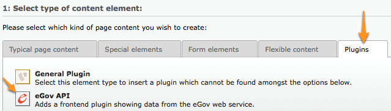

.. sectnum::
.. coding: utf-8 without BOM
.. _Show files in current folder: .

============================================================
EXT: eGov API
============================================================

:Extension Key: egovapi
:Language:      en, de, fr, it
:Keywords:      e-government, switzerland, administrative services, cyberadministration
:Author:        Causal Sàrl <xavier@causal.ch> for SECO
:Date:          2011-10-13
:Revision:      $Revision$
:Description:   This is the documentation for the TYPO3 extension egovapi

.. contents::

Introduction
============

What does it do?
----------------

In the digital age, enterprises and citizens should be able to ask for an administrative
authorization or an official register extract electronically. Thanks to the eGov CH Reference
project, they can access any useful information online 24/7 and order via internet or mobile phone.
The administration better responds to current requirements and customer needs, helping to reduce
bureaucracy and increasing the attractiveness of the Swiss economy.

The eGov API extension aims at providing an easy way to swiss public authorities to show and grant
access to the different administrative services they offer through their TYPO3 website.

Sponsorship
-----------

This extension is the official implementation of the swiss eGov Remote API for TYPO3. It has been
sponsored by the State Secretariat for Economic Affairs SECO which is the Confederation's competence
centre for all core issues relating to economic policy. The SECO wanted to improve the online access
to the administrative services they offer. This project has been developed and is being maintained
by Causal Sàrl, in Fribourg.

Further information:

- Website of the SECO: http://www.seco.admin.ch/
- Reference eGov project's website: http://www.cyberadmin.ch/
- Causal Sàrl: http://causal.ch/

Screenshots
-----------

.. image:: images/screenshots/overview.jpg
	:align: center


User manual
===========

Plugin options
--------------

The plugin is split among a general configuration tab and then a tab for each and every level of the
eGov API (Audience, View, Domain, Topic, Service). Finally a “Version” tab allows you to force a
given version of a service to be used instead of the default one. “Other Settings” provides a few
additional configuration options we will describe later on.

General
```````

.. image:: images/user_manual/general.png
	:align: center

The rules are as follows:

- If a field is left empty, the corresponding TypoScript property is taken into account.
- If the corresponding TypoScript property is empty, there is no restriction. In the screenshot
  above, leaving “Authorized levels” empty will let you freely navigate from Audience to Service
  back and forth.

**Backend administrators only:** Field myTS allows you to override the TypoScript configuration
after the merge of the FlexForm options. This is really the last chance to update the rendering
configuration. Any configuration option may be overridden except the web service related properties
(WSDL, cache lifetime, language, ...). A business processing makes use of it before the rendering
takes place. We assume it is more than unlikely to be needed anyway.

Level hierarchy
```````````````

Before actually describing the options of the level configuration tabs, it may help giving us an
overview of the level hierarchy within the eGov web service:

.. image:: images/user_manual/hierarchy.png
	:align: center

Audience
````````

.. image:: images/user_manual/audience.png
	:align: center

By selecting items, you trim down the list of items being shown by the plugin and this additionally
lets you manually order them.

Whenever you change the list of selected items in any of the Audience, View, Domain or Topic tab, you
should save your plugin configuration as the sublevel list of items in the next tab will be filtered
accordingly. E.g., in the screenshot above we selected “Entreprise” and “Personne privée” as
audiences to be shown and we ordered them to show “Entreprise” and then “Personne privée”. We should
now save the plugin configuration before moving on to tab “View” where we only will get views related
either to “Entreprise” or to “Personne privée” in the available items.

View
````

.. image:: images/user_manual/view.png
	:align: center

Domain
``````

.. image:: images/user_manual/domain.png
	:align: center


**Blocks to show:** This section is used when showing the details of a single domain. It allows us
to trim down the amount of information or to split them among multiple copies of the plugin on a
detail page.

Topic
`````


Service
```````

.. image:: images/user_manual/service.png
	:align: center

Version
```````

.. image:: images/user_manual/version.png
	:align: center

Domain Model
------------

This section describes the eGov API domain model. The domain model may be accessed directly when
using Fluid-based templates. If instead you use marker-based templates, only partial access to the
domain model will be possible and you probably will have to implement one of the available hooks
(see `Hooks`_ section in `Developer manual`_) for more complex scenarios.

We only describe domain model for the eGov API levels (audience, view, domain, topic, service).
Attributes for the blocks of information which are typically used for the details view of an entity
should be analyzed with Fluid template examples or by looking at the classes within directory
``Classes/Domain/Model/Blocks/`` (e.g., using http://api.causal.ch/egovapi/).

.. _tx_egovapi_domain_model_audience:

Audience (``tx_egovapi_domain_model_audience``)
```````````````````````````````````````````````

======================   =========
 Property                 Type
======================   =========
 id                       integer
 author                   string
 creationDate             integer (timestamp)
 lastModificationDate     integer (timestamp)
 name                     string
 views                    tx_egovapi_domain_model_view_ []
======================   =========

.. _tx_egovapi_domain_model_view:

View (``tx_egovapi_domain_model_view``)
```````````````````````````````````````

======================   =========
 Property                 Type
======================   =========
 id                       integer
 author                   string
 creationDate             integer (timestamp)
 lastModificationDate     integer (timestamp)
 name                     string
 domains                  tx_egovapi_domain_model_domain_ []
 audience                 tx_egovapi_domain_model_audience_
======================   =========

Additional template values:

- **hasParent** (boolean): set to TRUE if parent view may be shown on same page, otherwise FALSE.

.. _tx_egovapi_domain_model_domain:

Domain (``tx_egovapi_domain_model_domain``)
```````````````````````````````````````````

======================   =========
 Property                 Type
======================   =========
 id                       integer
 author                   string
 creationDate             integer (timestamp)
 lastModificationDate     integer (timestamp)
 name                     string
 description              string
 isParent                 boolean
 versionId                integer
 versionName              string
 communityId              string
 release                  integer
 remarks                  string
 status                   string
 generalInformation       tx_egovapi_domain_model_block_generalInformation
 news                     tx_egovapi_domain_model_block_news
 subdomains               tx_egovapi_domain_model_block_subdomains
 descriptor               tx_egovapi_domain_model_block_descriptor
 synonym                  tx_egovapi_domain_model_synonym
 topics                   tx_egovapi_domain_model_topic_ []
 view                     tx_egovapi_domain_model_view_
======================   =========

Additional template values:

- **hasParent** (boolean): set to TRUE if parent view may be shown on same page, otherwise FALSE.
- **showLevelInformation** (boolean): set to TRUE if level information block may be shown,
  otherwise FALSE.
- **showGeneralInformation** (boolean): set to TRUE if general information block may be shown,
  otherwise FALSE.
- **showNews** (boolean): set to TRUE if news block may be shown, otherwise FALSE.
- **showSubdomains** (boolean): set to TRUE if subdomains block may be shown, otherwise FALSE.
- **showDescriptor** (boolean): set to TRUE if descriptor block may be shown, otherwise FALSE.
- **showSynonym** (boolean): set to TRUE if synonym block may be shown, otherwise FALSE.

.. _tx_egovapi_domain_model_topic:

Topic (``tx_egovapi_domain_model_topic``)
`````````````````````````````````````````

======================   =========
 Property                 Type
======================   =========
 id                       integer
 author                   string
 creationDate             integer (timestamp)
 lastModificationDate     integer (timestamp)
 name                     string
 description              string
 isParent                 boolean
 versionId                integer
 versionName              string
 communityId              string
 release                  integer
 remarks                  string
 status                   string
 generalInformation       tx_egovapi_domain_model_block_generalInformation
 descriptor               tx_egovapi_domain_model_block_descriptor
 synonym                  tx_egovapi_domain_model_synonym
 services                 tx_egovapi_domain_model_service_ []
 domain                   tx_egovapi_domain_model_domain_
======================   =========

Additional template values:

- **hasParent** (boolean): set to TRUE if parent view may be shown on same page, otherwise FALSE.
- **showLevelInformation** (boolean): set to TRUE if level information block may be shown,
  otherwise FALSE.
- **showGeneralInformation** (boolean): set to TRUE if general information block may be shown,
  otherwise FALSE.
- **showNews** (boolean): set to TRUE if news block may be shown, otherwise FALSE.
- **showSubtopics** (boolean): set to TRUE if subtopics block may be shown, otherwise FALSE.
- **showDescriptor** (boolean): set to TRUE if descriptor block may be shown, otherwise FALSE.
- **showSynonym** (boolean): set to TRUE if synonym block may be shown, otherwise FALSE.

.. _tx_egovapi_domain_model_service:

Service (``tx_egovapi_domain_model_service``)
`````````````````````````````````````````````

======================   =========
 Property                 Type
======================   =========
 id                       integer
 author                   string
 creationDate             integer (timestamp)
 lastModificationDate     integer (timestamp)
 name                     string
 description              string
 isParent                 boolean
 versionId                integer
 versionName              string
 communityId              string
 release                  integer
 comments                 string
 provider                 string
 customer                 string
 type                     string
 action                   string
 status                   string
 generalInformation       tx_egovapi_domain_model_block_generalInformation
 prerequisites            tx_egovapi_domain_model_block_prerequisites
 procedure                tx_egovapi_domain_model_block_procedure
 forms                    tx_egovapi_domain_model_block_forms
 documentsRequired        tx_egovapi_domain_model_block_documentsRequired
 serviceProvided          tx_egovapi_domain_model_block_serviceProvided
 fee                      tx_egovapi_domain_model_block_fee
 legalRegulation          tx_egovapi_domain_model_block_legalRegulation
 documentsOther           tx_egovapi_domain_model_block_documentsOther
 remarks                  tx_egovapi_domain_model_block_remarks
 approval                 tx_egovapi_domain_model_block_approval
 contact                  tx_egovapi_domain_model_block_contact_
 topic                    tx_egovapi_domain_model_topic_
======================   =========

Additional template values:

- **hasParent** (boolean): set to TRUE if parent view may be shown on same page, otherwise FALSE.
- **showLevelInformation** (boolean): set to TRUE if level information block may be shown,
  otherwise FALSE.
- **showGeneralInformation** (boolean): set to TRUE if general information block may be shown,
  otherwise FALSE.
- **showPrerequisites** (boolean): set to TRUE if prerequisites block may be shown, otherwise
  FALSE.
- **showProcedure** (boolean): set to TRUE if procedure block may be shown, otherwise FALSE.
- **showForms** (boolean): set to TRUE if forms block may be shown, otherwise FALSE.
- **showDocumentsRequired** (boolean): set to TRUE if documents required block may be shown,
  otherwise FALSE.
- **showServiceProvided** (boolean): set to TRUE if service provided block may be shown, otherwise
  FALSE.
- **showFee** (boolean): set to TRUE if fee block may be shown, otherwise FALSE.
- **showLegalRegulation** (boolean): set to TRUE if legal regulation block may be shown, otherwise
  FALSE.
- **showDocumentsOther** (boolean): set to TRUE if documents other block may be shown, otherwise
  FALSE.
- **showRemarks** (boolean): set to TRUE if remarks block may be shown, otherwise FALSE.
- **showApproval** (boolean): set to TRUE if approval block may be shown, otherwise FALSE.
- **showContact** (boolean): set to TRUE if contact block may be shown, otherwise FALSE.
- **showBackToList** (boolean): set to TRUE if back to list block may be shown, otherwise FALSE.

.. _tx_egovapi_domain_model_block_contact:

Service (``tx_egovapi_domain_model_block_contact``)
```````````````````````````````````````````````````

======================   =========
 Property                 Type
======================   =========
 department               string
 office                   string
 address                  string
 postalCase               string
 postalCode               string
 locality                 string
 person                   string
 phone                    string
 fax                      string
 email                    string
 publicKey                string
 logo                     string
 banner                   string
 openingHours             string
======================   =========

Available markers and subparts
------------------------------

When using marker-based templates, domain model attributes are available as

``###{ENTITY}_{ATTRIBUTE}###``

The full list of available markers is as follows:

Audience
````````

Markers
*******

- AUDIENCE_ID
- AUDIENCE_NAME
- AUDIENCE_AUTHOR
- AUDIENCE_CREATION_DATE (formatted as dd.mm.yyyy)
- AUDIENCE_LAST_MODIFICATION_DATE (formatted as dd.mm.yyyy)

Subparts
********

- AUDIENCE_LINK_VIEWS
- AUDIENCE_LINK_DETAIL

View
````

Markers
*******

- VIEW_ID
- VIEW_NAME
- VIEW_AUTHOR
- VIEW_CREATION_DATE (formatted as dd.mm.yyyy)
- VIEW_LAST_MODIFICATION_DATE (formatted as dd.mm.yyyy)

Subparts
********

- VIEW_LINK_DOMAINS
- VIEW_LINK_DETAIL
- HAS_PARENT
- VIEW_LINK_AUDIENCES
- VIEW_LINK_AUDIENCE

Domain
``````

Markers
*******

- DOMAIN_ID
- DOMAIN_NAME
- DOMAIN_DESCRIPTION
- DOMAIN_IS_PARENT
- DOMAIN_VERSION_ID
- DOMAIN_VERSION_NAME
- DOMAIN_COMMUNITY_ID
- DOMAIN_RELEASE
- DOMAIN_REMARKS
- DOMAIN_STATUS
- DOMAIN_AUTHOR
- DOMAIN_CREATION_DATE (formatted as dd.mm.yyyy)
- DOMAIN_LAST_MODIFICATION_DATE (formatted as dd.mm.yyyy)
- DOMAIN_GENERAL_INFORMATION
- DOMAIN_NEWS
- DOMAIN_SUBDOMAINS
- DOMAIN_DESCRIPTION
- DOMAIN_SYNONYM

Subparts
********

- DOMAIN_LINK_TOPICS
- DOMAIN_LINK_DETAIL
- HAS_PARENT
- DOMAIN_LINK_VIEWS
- DOMAIN_LINK_VIEW
- SHOW_LEVEL_INFORMATION
- SHOW_GENERAL_INFORMATION
- SHOW_NEWS
- SHOW_SUBDOMAINS
- SHOW_DESCRIPTOR
- SHOW_SYNONYM

Topic
`````

Markers
*******

- TOPIC_ID
- TOPIC_NAME
- TOPIC_DESCRIPTION
- TOPIC_IS_PARENT
- TOPIC_VERSION_ID
- TOPIC_VERSION_NAME
- TOPIC_COMMUNITY_ID
- TOPIC_RELEASE
- TOPIC_REMARKS
- TOPIC_STATUS
- TOPIC_AUTHOR
- TOPIC_CREATION_DATE (formatted as dd.mm.yyyy)
- TOPIC_LAST_MODIFICATION_DATE (formatted as dd.mm.yyyy)
- TOPIC_GENERAL_INFORMATION
- TOPIC_NEWS
- TOPIC_SUBTOPICS
- TOPIC_DESCRIPTOR
- TOPIC_SYNONYM

Subparts
********

- TOPIC_LINK_SERVICES
- TOPIC_LINK_DETAIL
- HAS_PARENT
- TOPIC_LINK_DOMAINS
- TOPIC_LINK_DOMAIN
- SHOW_LEVEL_INFORMATION
- SHOW_GENERAL_INFORMATION
- SHOW_NEWS
- SHOW_SUBTOPICS
- SHOW_DESCRIPTOR
- SHOW_SYNONYM

Service
```````

Markers
*******

- SERVICE_ID
- SERVICE_NAME
- SERVICE_DESCRIPTION
- SERVICE_VERSION_ID
- SERVICE_VERSION_NAME
- SERVICE_COMMUNITY_ID
- SERVICE_RELEASE
- SERVICE_COMMENTS
- SERVICE_PROVIDER
- SERVICE_CUSTOMER
- SERVICE_TYPE
- SERVICE_ACTION
- SERVICE_STATUS
- SERVICE_AUTHOR
- SERVICE_CREATION_DATE (formatted as dd.mm.yyyy)
- SERVICE_LAST_MODIFICATION_DATE (formatted as dd.mm.yyyy)
- SERVICE_GENERAL_INFORMATION
- SERVICE_PREREQUISITES
- SERVICE_PROCEDURE
- SERVICE_FORMS
- SERVICE_DOCUMENTS_REQUIRED
- SERVICE_SERVICE_PROVIDED
- SERVICE_FEE
- SERVICE_LEGAL_REGULATION
- SERVICE_DOCUMENTS_OTHER
- SERVICE_REMARKS
- SERVICE_APPROVAL
- SERVICE_CONTACT
- SERVICE_CONTACT_DEPARTMENT
- SERVICE_CONTACT_OFFICE
- SERVICE_CONTACT_ADDRESS
- SERVICE_CONTACT_PO_BOX
- SERVICE_CONTACT_POSTAL_CODE
- SERVICE_CONTACT_LOCALITY
- SERVICE_CONTACT_PERSON
- SERVICE_CONTACT_PHONE
- SERVICE_CONTACT_FAX
- SERVICE_CONTACT_EMAIL
- SERVICE_CONTACT_EMAIL_LINK
- SERVICE_CONTACT_PUBLIC_KEY
- SERVICE_CONTACT_LOGO
- SERVICE_CONTACT_BANNER
- SERVICE_CONTACT_OPENING_HOURS
- VCARD_URL

Subparts
********

- SERVICE_LINK_DETAIL
- HAS_PARENT
- SERVICE_LINK_TOPICS
- SERVICE_LINK_TOPIC
- SERVICE_LINK_SERVICES
- SHOW_LEVEL_INFORMATION
- SHOW_GENERAL_INFORMATION
- SHOW_PREREQUISITES
- SHOW_PROCEDURE
- SHOW_FORMS
- SHOW_DOCUMENTS_REQUIRED
- SHOW_SERVICE_PROVIDED
- SHOW_FEE
- SHOW_LEGAL_REGULATION
- SHOW_DOCUMENTS_OTHER
- SHOW_REMARKS
- SHOW_APPROVAL
- SHOW_CONTACT
- SHOW_BACK_TO_LIST

Administration
==============

This chapter describes how to manage the extension from a superuser point of view.

Installing the extension
------------------------

There are a few steps necessary to install the eGov API extension. If you have installed other
extensions in the past, you will run into little new here.

Install the extension from Extension Manager
````````````````````````````````````````````

The eGov API extension can ben installed through the typical TYPO3 installation process using the
Extension Manager.

During the installation process, you may be invited to install additional suggested extensions that
interact with the eGov API extension. These are alls imply suggestions and can safely be ignored if
you choose.

**Note:** If you plan to use Fluid as template engine, then you must install that system extension
before installing the eGov API extension. The minimum required version of this system extension is
1.3.0 meaning it requires TYPO3 4.5 or above as Fluid template within the eGov API extension are
using the FLUIDTEMPLATE content object which was introduced with TYPO3 4.5.

If you use TYPO3 4.5 or below, you have to create the two proposed caching tables. These tables
(not needed anymore with TYPO3 4.6 and above) are being used by the TYPO3 caching framework if you
choose to use a database backend (see below).

Since version 1.2.0 a selector plugin has been added, allowing you to show a form aimed at
dynamically generating parametrized URIs, for non-TYPO3 websites willing to integrate e-government
web service anyway. It has to be activated in Extension Manager:


Configure data caching
``````````````````````

In order to prevent unnecessary traffic with the eGov servers hosting the web service, data caching
should be configured. The extension makes use of TYPO3 caching framework. If you are using TYPO3
prior to 4.6, you have to activate the caching framework using either the Install Tool or by editing
file ``typo3conf/localconf.php`` and adding following line:

::

	$TYPO3_CONF_VARS['SYS']['useCachingFramework'] = 1;

Activating caching framework will ensure that the same information is not retrieved twice during a
single request. However, once the request is over, the cache is flushed as it internally uses a
TransientMemoryBackend.

In order to cache data for a longer period of time, you should provide a caching configuration for
the eGov API extension. A typical configuration to cache data in the database is:

::

	$TYPO3_CONF_VARS['SYS']['caching']['cacheConfigurations']['egovapi'] = array(
		'frontend' => 't3lib_cache_frontend_VariableFrontend',
		'backend' => 't3lib_cache_backend_DbBackend',
		'options' => array(
			'cacheTable' => 'cf_egovapi',
			'tagsTable' => 'cf_egovapi_tags',
		)
	);

**Important note:** The “cacheTable” and “tagsTable” parts are not relevant anymore if you use
TYPO3 4.6 and above as the caching framework uses it own table structure (creation of the
corresponding tables when installing the eGov API extension is thus useless as well). See the
corresponding task on Forge if you want to learn more.

Please refer to the TYPO3 documentation for further configuration options.

Configure advanced data caching
```````````````````````````````

Since web service version 2, the eGov API extension can take advantage of an operation returning
recently updated services. This lets you configuring an unlimited cache lifetime (see chapter
`Configuration`_) and invalidate cache entry as they are updated. This is done by regularly running
(e.g., every 1-2 days) scheduler task “Latest changes in eGov API” for all communities you are
retrieving data for.

Configure RealURL
`````````````````

If you are using RealURL, the good news is that the eGov API extension comes with a configuration
for RealURL.

If your configuration is automatically generated (you have a ``typo3conf/realurl_autoconf.php``
file), delete it. It will be recreated by RealURL the next time you render your page and will
integrate our postVarSets configuration.

If you manually tweaked the configuration (you have a ``typo3conf/realurl_conf.php`` file), here is
the configuration we suggest:

::

	'postVarSets' => array(
		'_DEFAULT' => array(
			'audience' => array(
				array(
					'GETvar' => 'tx_egovapi_pi1[audience]',
				),
			),
			'view' => array(
				array(
					'GETvar' => 'tx_egovapi_pi1[view]',
				),
			),
			'domain' => array(
				array(
					'GETvar' => 'tx_egovapi_pi1[domain]',
				),
			),
			'topic' => array(
				array(
					'GETvar' => 'tx_egovapi_pi1[topic]',
				),
			),
			'service' => array(
				array(
					'GETvar' => 'tx_egovapi_pi1[service]',
				),
			),
			'action' => array(
				array(
					'GETvar' => 'tx_egovapi_pi1[action]',
				)
			),
			'mode' => array(
				array(
					'GETvar' => 'tx_egovapi_pi1[mode]',
				)
			),
		),
	),

TypoScript configuration
------------------------

In order for this extension to be usable, make sure to include at least the static template
“settings” from the eGov API extension. To do that, click on Web > Template in the left frame and
then select the root page of the website. You template will show up. Then click on link “Edit the
whole template record”, open tab “Includes” and add static template from extension egovapi.

You are presented with two items in the list of available items. One is “eGov API settings
(egovapi)”, the other is “eGov API CSS-styles (egovapi)”. You should at least add the settings. The
CSS styles may serve as example for styling the extension's output and should even be omitted if
you want to use your own CSS.

.. image:: images/administration/info_modify.png
	:align: center

.. image:: images/administration/include_ts.png
	:align: center

Save changes to your templates and close this form. Then open the Constant Editor from the drop-down
menu and update global configuration to fit your needs:


There are many other options such as the language of the web service which should typically be
related to the value of config.language in your setup.

If you are running a recent version of TYPO3 (≥ 4.5.0), you definitively should use Fluid as
rendering engine. This requires system extension fluid to be loaded. Using Fluid will highly ease
the way you prepare your templates and will let you have full control over the way web service data
are rendered.

Selector Form Plugin
--------------------

If you activated the selector form plugin within the Extension Manager, you will see an additional
plugin available in the new content element wizard:


The selector form plugin requires a dedicated static TypoScript, the “eGov API selector settings”
and possibly the default CSS styles, as for the main plugin. Make sure to properly configure
constant plugin.tx_egovapi.targets.single.service with the UID of the page containing the main
plugin.

The plugin is shipped with a standard jQuery-based javascript using AJAX queries to refresh the
form. A custom demo version has been integrated on
http://fr.causal.ch/realisations/api-e-government/demo/.

**Beware:** The main plugin should use settings “eGov API selector settings” too and not the
default ones.

Generating legacy parametrized URL
``````````````````````````````````

You may want to use the selector form plugin to generate parametrized URL compatible with the
legacy service handler on www.cyberadmin.ch. Below is a configuration example for generating such
URLs.

::

	plugin.tx_egovapi_pi2.parametrizedUrl = TEXT
	plugin.tx_egovapi_pi2.parametrizedUrl {
		typolink {
			parameter = http://www.cyberadmin.ch/eGovApi/
			parameter.wrap.cObject = COA
			parameter.wrap.cObject {
				1 = TEXT
				1.value = |

				10 = TEXT
				10.data = GP:language
				10.wrap = ?eCHlanguageID=|
				10.case = upper
				20 = TEXT
				20.data = GP:organization
				20.wrap = &eCHmunicipalityID=|
				30 = TEXT
				30.field = id
				30.wrap = &eCHserviceID=|
				40 = TEXT
				40.field = versionId
				40.wrap = &eCHserviceVersionID=|
				50 = TEXT
				50.data = GP:blocks
				50.wrap = &eCHserviceBlock=|
				60 = TEXT
				60.value = htmlpagecss
				60.wrap = &eCHapiFormat=|
				70 = TEXT
				70.value = utf-8
				70.wrap = &eCHapiEncode=|
			}
		}
	}


Configuration
=============

plugin.tx_egovapi_pi1
---------------------

plugin.tx_egovapi_pi1.displayBlocks
-----------------------------------

plugin.tx_egovapi_pi1.versions
------------------------------

plugin.tx_egovapi_pi1.targets
-----------------------------

plugin.tx_egovapi_pi1.templates
-------------------------------

plugin.tx_egovapi_pi2
---------------------


Tutorial
========

This tutorial is best suited for day-to-day webmasters or editors having to integrate the eGov API
within their website. It assumes an administrator already properly installed this extension (see
chapter `Administration`_). It is targeted at users and as such section “`Plugin options`_” of
chapter `User manual`_) is part of the basic know-how the webmaster or editor should have to be
able to use this extension.

Use case
--------

Description
```````````

You would like to show the list of service domains available for the audience “Personne privée”
(100) in some part of your website.

Step-by-step explanation
````````````````````````

1. Open Web > Page module and navigate within your website to the page where you would like to
   add the eGov API plugin.
2. Click on icon |new_ce| to add a content element to your page
3. Move to section “Plugins” and select the eGov API plugin:




After having given a header to your content element as a best practice (possibly set its rendering
Type to hidden), you should configure the eGov API plugin:


1. Move to the “Plugin” tab to access plugin's configuration options
2. Select “General” option tab
3. Authorize level “Domain” to be shown. As this is the only selected level, it will be used as
   entry point for the plugin and will not allow navigation to other levels. If you need this, you
   may either add other authorized levels after the entry point level or configure redirect pages
   containing plugins for the other levels on “Other Settings” option tab.

Last step is to configure the plugin in order to only show the audience “Personne privée”:

.. image:: images/tutorial/audience_personne_privee.png
	:align: center

1. Select “Audience” option tab
2. Select audience “Personne privée”.

That's it! If you show your page, you should have a list of domains related to the audience
“Personne privée”:

.. image:: images/tutorial/result.png
	:align: center


Developer manual
================

This chapter is really targeted at extension developers. Most TYPO3 integrators should never have
the need to go that deep in order for them to configure the eGov API extension to fit their
integration needs. If however you encounter some limitation you cannot solve using TypoScript
configuration, you may want to read the following sections to learn how to take more control.

Hooks
-----

Some hooks have been integrated into the eGov API extension. They are primarily targeted at letting
you post-process the subparts and markers prior to the actual rendering process, when using
marker-based templates or to post-process the AJAX returned data. Hooks have not been used for
Fluid-based templates as you may achieve the same goal with TypoScript configuration or use of
ViewHelpers.

Following hooks are available:

- Final post-processing:

    ``$GLOBALS['TYPO3_CONF_VARS']['EXTCONF']['egovapi']['renderHook']``

- Post-processing of audience subparts and markers:

    ``$GLOBALS['TYPO3_CONF_VARS']['EXTCONF']['egovapi']['prepareAudienceHook']``

- Post-processing of view subparts and markers:

    ``$GLOBALS['TYPO3_CONF_VARS']['EXTCONF']['egovapi']['prepareViewHook']``

- Post-processing of domain subparts and markers:

    ``$GLOBALS['TYPO3_CONF_VARS']['EXTCONF']['egovapi']['prepareDomainHook']``

- Post-processing of topic subparts and markers:

    ``$GLOBALS['TYPO3_CONF_VARS']['EXTCONF']['egovapi']['prepareTopicHook']``

- Post-processing of service subparts and markers:

    ``$GLOBALS['TYPO3_CONF_VARS']['EXTCONF']['egovapi']['prepareServiceHook']``

- Post-processing of AJAX returned data:

    ``$GLOBALS['TYPO3_CONF_VARS']['EXTCONF']['egovapi']['ajaxHook']``

API documentation
-----------------

The latest API documentation may be manually generated using doxygen configuration file
``doc/doxygen.conf``.

Alternatively, you may access it from http://api.causal.ch/egovapi/.

eGov web service
----------------

The eGov web service is documented by the corresponding WSDL.

When accessing this WSDL endpoint, XML schemas are defined as namespaces. The underlying XSD files
may be retrieved by prefixing the namespace by http://ref.cyberadmin.ch/WS20/ServiceContract/.
E.g., the schema of "dataCommonBlocks" may be accessed with
http://ref.cyberadmin.ch/WS20/Service/Contract/MessageContract/DataContract/CommonBlocks.xsd.


Known problems
==============

Please use the extension's bug tracker on Forge to report bugs:
http://forge.typo3.org/projects/extension-egovapi/issues.


To-Do list
==========

Please use the extension's bug tracker on Forge to propose new features:
http://forge.typo3.org/projects/extension-egovapi/issues.


ChangeLog
=========

The following is a very high level overview of the changes in this extension. For more details, see
the ChangeLog file included with the extension or `read it online
<http://forge.typo3.org/projects/extension-egovapi/repository/entry/trunk/ChangeLog/>`_.

+-------------+----------------------------------------------------------------------------------+
| Version     | Changes                                                                          |
+=============+==================================================================================+
| 1.5.0       | - Google Map and loading mask support                                            |
|             | - Localization files have been converted to XLIFF                                |
+-------------+----------------------------------------------------------------------------------+
| 1.4.0       | - Added support for both the existing web service and its upcoming new version   |
|             | - Tested with TYPO3 4.6                                                          |
+-------------+----------------------------------------------------------------------------------+
| 1.3.0       | - Added microformat markers (hCard) for the service's office                     |
|             | - Services are grouped by provider for the selector form plugin                  |
+-------------+----------------------------------------------------------------------------------+
| 1.2.0       | - Selector form plugin added                                                     |
+-------------+----------------------------------------------------------------------------------+
| 1.1.0       | - Completed German translation                                                   |
+-------------+----------------------------------------------------------------------------------+
| 1.0.0       | - Stable release                                                                 |
|             | - Updated documentation with additional screenshots                              |
|             | - Updated templates with additional CSS classes                                  |
+-------------+----------------------------------------------------------------------------------+
| 0.9.0       | - Further documentation                                                          |
+-------------+----------------------------------------------------------------------------------+
| 0.8.0       | - First release on TER                                                           |
+-------------+----------------------------------------------------------------------------------+
