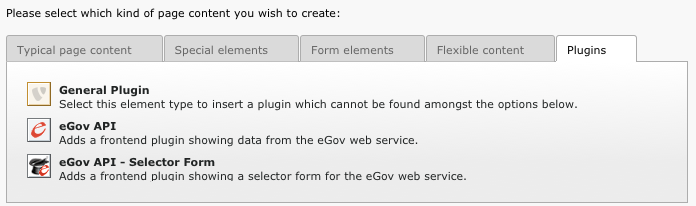

Selector Form Plugin
====================

If you activated the selector form plugin within the Extension Manager, you will see an additional
plugin available in the new content element wizard:

The selector form plugin requires a dedicated static TypoScript, the “eGov API selector settings”
and possibly the default CSS styles, as for the main plugin. Make sure to properly configure
constant plugin.tx_egovapi.targets.single.service with the UID of the page containing the main
plugin.

The plugin is shipped with a standard jQuery-based javascript using AJAX queries to refresh the
form. A custom demo version has been integrated on
http://fr.causal.ch/realisations/api-e-government/demo/.

**Beware:** The main plugin should use settings “eGov API selector settings” too and not the
default ones.

Generating legacy parametrized URL
----------------------------------

You may want to use the selector form plugin to generate parametrized URL compatible with the
legacy service handler on www.cyberadmin.ch. Below is a configuration example for generating such
URLs.

::

	plugin.tx_egovapi_pi2.parametrizedUrl = TEXT
	plugin.tx_egovapi_pi2.parametrizedUrl {
		typolink {
			parameter = http://www.cyberadmin.ch/eGovApi/
			parameter.wrap.cObject = COA
			parameter.wrap.cObject {
				1 = TEXT
				1.value = |

				10 = TEXT
				10.data = GP:language
				10.wrap = ?eCHlanguageID=|
				10.case = upper
				20 = TEXT
				20.data = GP:organization
				20.wrap = &eCHmunicipalityID=|
				30 = TEXT
				30.field = id
				30.wrap = &eCHserviceID=|
				40 = TEXT
				40.field = versionId
				40.wrap = &eCHserviceVersionID=|
				50 = TEXT
				50.data = GP:blocks
				50.wrap = &eCHserviceBlock=|
				60 = TEXT
				60.value = htmlpagecss
				60.wrap = &eCHapiFormat=|
				70 = TEXT
				70.value = utf-8
				70.wrap = &eCHapiEncode=|
			}
		}
	}