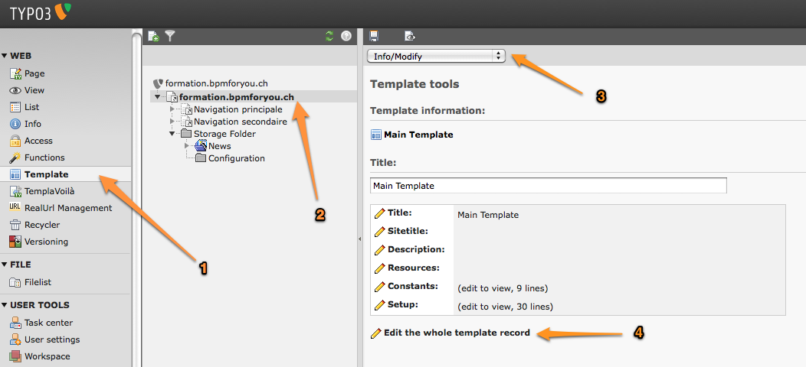
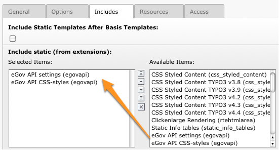
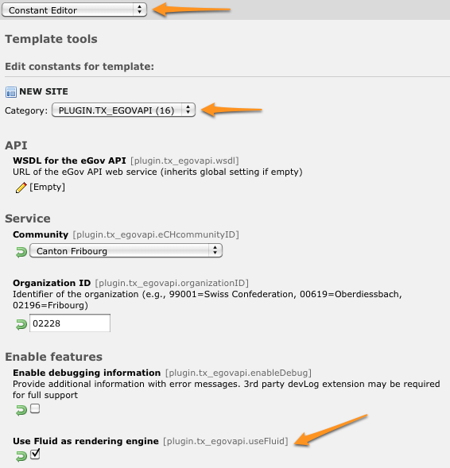

TypoScript configuration
========================

In order for this extension to be usable, make sure to include at least the static template
“settings” from the eGov API extension. To do that, click on Web > Template in the left frame and
then select the root page of the website. You template will show up. Then click on link “Edit the
whole template record”, open tab “Includes” and add static template from extension egovapi.

You are presented with two items in the list of available items. One is “eGov API settings
(egovapi)”, the other is “eGov API CSS-styles (egovapi)”. You should at least add the settings. The
CSS styles may serve as example for styling the extension's output and should even be omitted if
you want to use your own CSS.

Save changes to your templates and close this form. Then open the Constant Editor from the drop-down
menu and update global configuration to fit your needs:

There are many other options such as the language of the web service which should typically be
related to the value of config.language in your setup.

If you are running a recent version of TYPO3 (≥ 4.5.0), you definitively should use Fluid as
rendering engine. This requires system extension fluid to be loaded. Using Fluid will highly ease
the way you prepare your templates and will let you have full control over the way web service data
are rendered.
